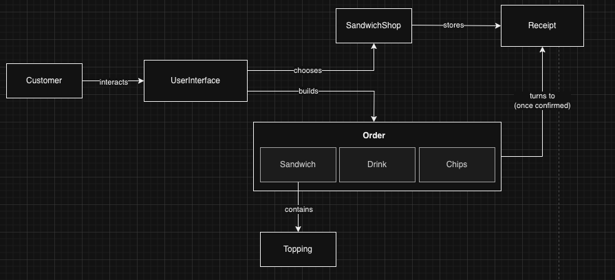
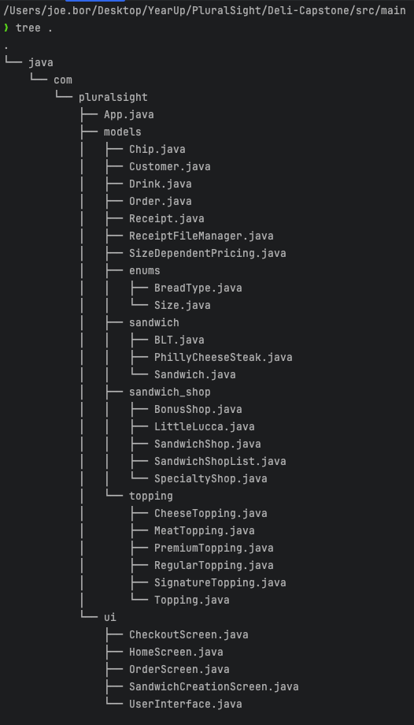
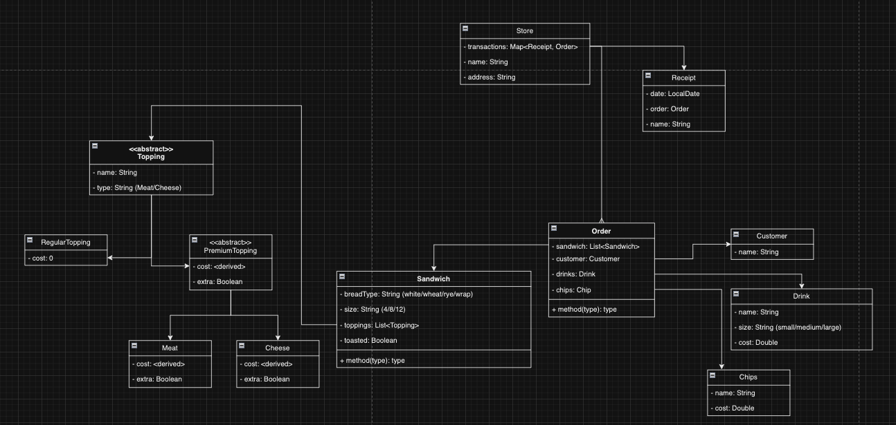
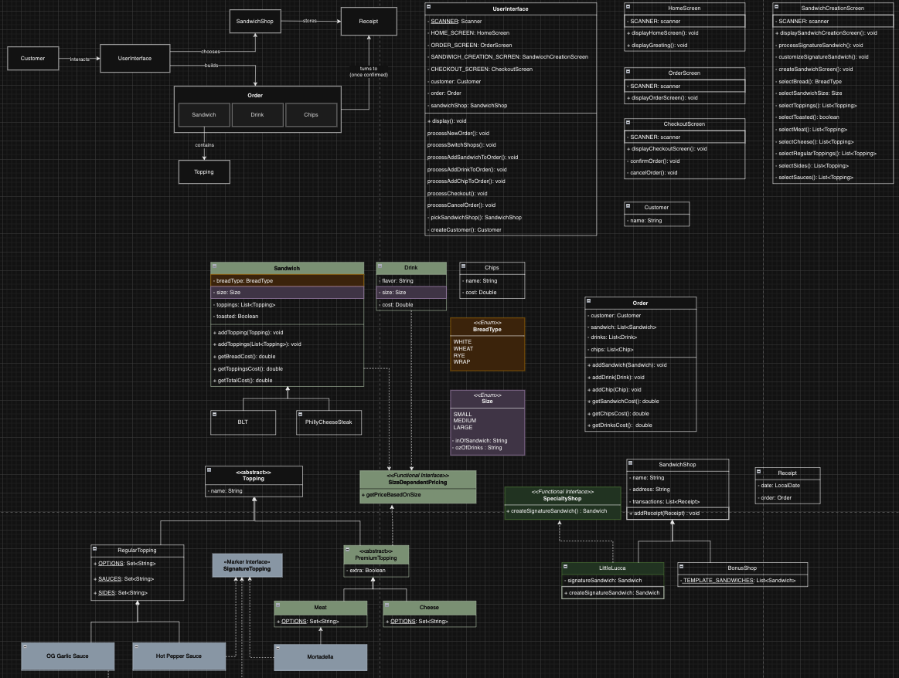
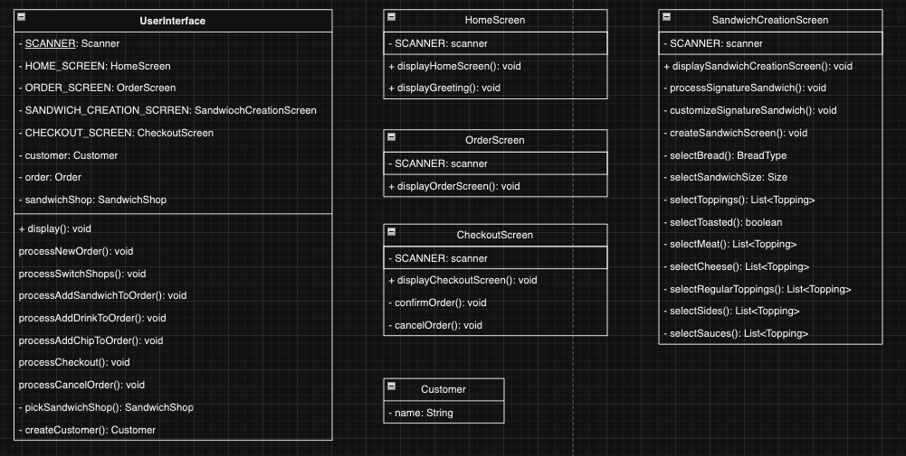
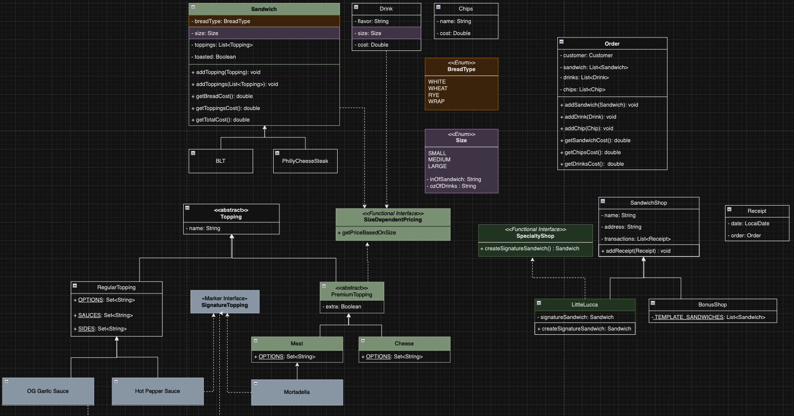

# Deli-cious

This project is a command-line interface (CLI) application that allows users to browse through stores, customize
orders (mostly sandwiches), and confirm orders. Think doordash, but much less complex and only caters to sandwich shops.

[Link to GitHub Project](https://github.com/users/joe-bor/projects/7/views/1)

---

## Table of Contents

- [Requirements](#requirements)
- [Usage](#usage)
- [How it Works](#how-it-works)
- [Features](#features)
- [Screenshots](#screenshots)
- [File `transactions.csv` Format](#file-transactionscsv-format)
- [Custom Search Capabilities](#custom-search-capabilities)

---

## Requirements

- [Git](https://git-scm.com/downloads)
- [Java 21](https://www.oracle.com/th/java/technologies/downloads/) or Higher
- [IntelliJ IDEA](https://www.jetbrains.com/idea/download/)

---

## How It Works



- **Customer**: Represents the User of the application.
- **User Interface**: Manages the interaction flow, including store selections and order creation.
- **Order**: Contains details about the customer's order.
- **SandwichShop**: Handles the order fulfillment and stores the `Receipt` object.
- **Receipt**: Generated once the order is confirmed, and can be used for future references.

---

## Features

1. **Store Selection**
    - Customers can select a store.
    - Some stores offer `toppings` exclusive to them.
    - Others have `pre-built` sandwiches you can customize.
2. **Order Building**
    - Customers can build and customize their orders(e.g. choose bread type, toppings, etc.)
3. **Receipt Management**
   - Each store maintains a record of confirmed orders.
   - For every transaction (Receipt), a corresponding directory is created in the root of the repository, where a text file representation of the transaction is stored.

---

## Screenshots

***Project Structure***




***First Draft of UML***



***Finalized UML***


[Link to UML](https://drive.google.com/file/d/1HKI0WsdOMcw6uM0pAs3mOIvtg8xVqoIr/view?usp=drive_link)

***User-facing Classes (top-right of final UML)***


***Main Interaction (bottom-half of final UML)***



---

[](https://git.io/typing-svg)

```java
// inside SandwichCreationScreen.java

private void processSignatureSandwich(Order order, SandwichShop sandwichShop) {
   Sandwich selectedSandwich = switch (sandwichShop) {
      case SpecialtyShop specialtyShop -> specialtyShop.createSignatureSandwich();
      case BonusShop bonusShop -> new Sandwich(); // actual implementation not shown for brevity
      default -> null;
   };
}
```
I am low-key obsessed with `switch expressions` because of how versatile it can be. I find it really exciting to be able to use its `pattern matching` capabilities for the first time, especially since I learned about them early in the class.